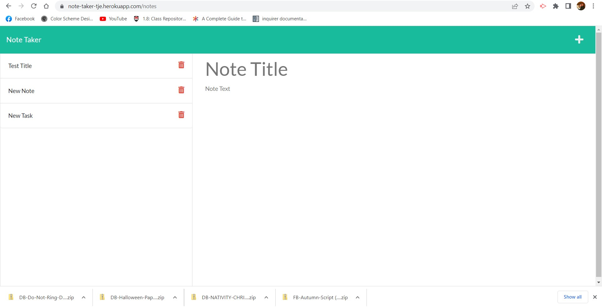

# Note Taker Starter Code

Instructions:  To run this program you need to open the server.js file in the root directory,  Open the terminal and install express.js and initialize npm.

GitHub repo: https://github.com/tarajevans/note-taker

GitHub Deployed: https://tarajevans.github.io/note-taker/

Heroku:https://note-taker-tje.herokuapp.com

Live Walkthru: https://drive.google.com/file/d/12D9YdOzpXDivT2HWgleRZrccJxqTZIPK/view

